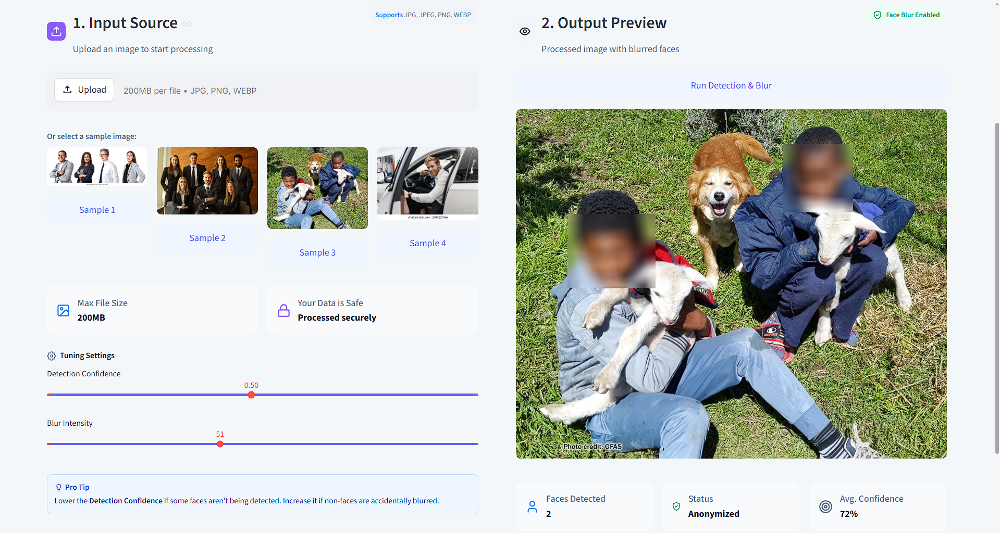
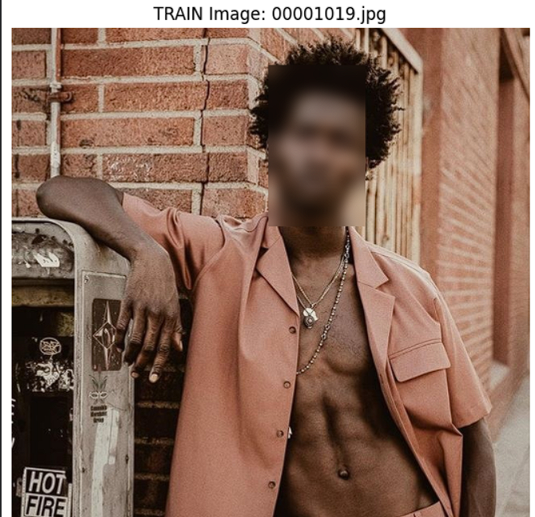
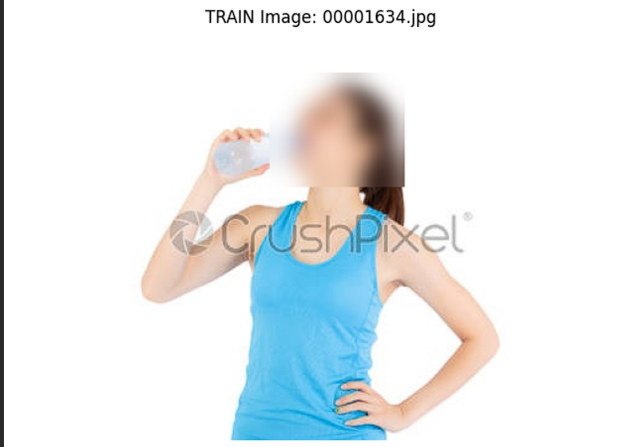
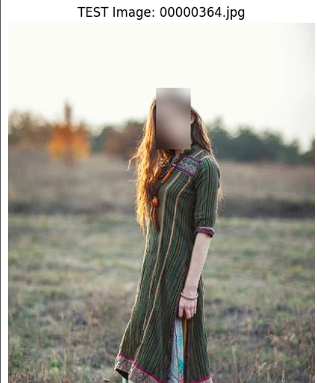

# 🛡️ VisionAI Face Guard


**VisionAI Face Guard** is a highly accurate, automated privacy-focused web application that detects faces in images and automatically applies an intelligent blur to protect identities. Built with a custom-trained **YOLOv8 neural network**, it offers high precision combined with a modern, glassmorphic UI.

<br>

<div align="center">
  
  <p><i>The premium Streamlit UI demonstrating real-time face detection and blurring</i></p>
</div>

---

## ✨ Features
- **High-Speed Detection**: Uses a custom YOLOv8 model (`face_detector_yolov8.pt`) to instantly find multiple faces in complex scenes.
- **Adjustable Privacy Controls**: Real-time sliders allow users to tweak Detection Confidence and Blur Intensity.
- **Premium User Interface**: A minimalist, "Emoji-Free", glassmorphic Streamlit interface using custom SVG icons and Inter typography.
- **Sample Predictions**: One-click sample image testing for quick demonstrations.
- **Secure Processing**: Runs inference instantly; images are processed in-memory and never stored.

---

## 🚀 How to Use
1. **Upload an Image**: Drag and drop or click to upload your image in the **Input Source** section.
2. **Select Sample**: Alternatively, click one of the pre-loaded **Sample Images** for a quick preview.
3. **Tune Settings**: Adjust the **Detection Confidence** and **Blur Intensity** sliders to get the perfect result.
4. **Run Detection**: Click the **"Run Detection & Blur"** button to process the image.
5. **View Result**: Check the **Output Preview** to see the anonymized image and detection metrics.

---

## 📸 Training Results & Preview
These images showcase the training results and the model's performance in detecting and blurring faces accurately:

<p align="center">
  
  
  
</p>

*The custom-trained YOLOv8 model ensures high accuracy in various lighting conditions and angles.*

---

## 🛠️ Tech Stack
1. **Frontend**: [Streamlit](https://streamlit.io/) (with custom CSS injection)
2. **Computer Vision**: [OpenCV Headless](https://pypi.org/project/opencv-python-headless/)
3. **Deep Learning Model**: [Ultralytics YOLOv8](https://github.com/ultralytics/ultralytics) (Custom weights)
4. **Environment**: Python 3.9+

---

## 🚀 How to Run Locally

If you want to run this application on your local machine, follow these steps:

1. **Clone the Repository**
   ```bash
   git clone https://github.com/GITLAGGUI/face-blur-app.git
   cd face-blur-app
   ```

2. **Install Dependencies**
   It is recommended to use a virtual environment.
   ```bash
   pip install -r requirements.txt
   ```

3. **Run the Application**
   ```bash
   streamlit run app.py
   ```

4. **Open in Browser**
   Navigate to `http://localhost:8501` in your web browser.

---

## ☁️ Deployment
This application is fully optimized for **Streamlit Community Cloud**. 
- It uses `opencv-python-headless` to bypass missing system GL libraries.
- It is configured to install the CPU-only version of PyTorch to ensure incredibly fast builds and prevent memory crashes during deployment.

---

## 👨‍💻 Developed By
**Joel**

*Detect faces accurately and automatically blur them to protect identity and ensure privacy.*
